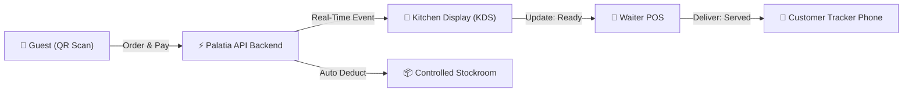

# Palatia — Integrated QR Self-Ordering & Real-Time Restaurant Operating System (OS)

> **Elevator Pitch:** Palatia is an end-to-end, real-time restaurant operating system that bridges guest self-ordering, live kitchen tracking, waiter POS operations, and controlled recipe inventory management into one unified, low-latency web platform.

---

## 📌 Executive Summary

Modern restaurants face severe operational bottlenecks: long guest wait times for waiter service, kitchen miscommunication during peak hours, lack of order visibility for customers, and inventory leakage from uncontrolled recipes. 

**Palatia** solves these challenges by combining:
1. **Guest QR Table Self-Ordering & E-Payment** (No app installation required).
2. **Real-Time Live Cooking Status Tracker** via WebSockets (Socket.io).
3. **Kitchen Display System (KDS)** for line chefs and kitchen staff.
4. **Waiter POS & Billing System** with table status management and instant invoice printing.
5. **Controlled Inventory & Recipe Stock Deduction** to guarantee taste consistency and prevent stock leakage.
6. **Multi-Role Surface Authorization** isolating customer portals from staff backoffice interfaces.

---

## 🎯 Problem Statement & Real-World Pain Points

| Pain Point | Impact on Restaurant Operations | Palatia Solution |
| :--- | :--- | :--- |
| **Long Waiter Wait Times** | Guests wait 10–15 minutes just to call a waiter, leading to poor customer satisfaction. | **Instant QR Self-Ordering:** Guests scan the table QR code on their phone, pick items, add kitchen notes, and pay immediately. |
| **Order Miscommunication** | Verbal orders or handwritten notes lead to missed food allergies, wrong dishes, or special request errors. | **Digital Kitchen Display (KDS):** Exact customer notes and item quantities appear instantly on the kitchen screen. |
| **Lack of Order Visibility** | Guests constantly ask waiters *"Is my food coming?"*, increasing staff workload. | **Live Real-Time Status Tracker:** Customers monitor their dish status live from their phone (Received ➔ Paid ➔ Cooking ➔ Ready ➔ Done). |
| **Stock Leakage & Waste** | Unmeasured recipes cause inconsistent taste across shifts and unmonitored ingredient loss. | **Controlled Recipe Engine:** Every menu item is tied to exact ingredient quantities; stock is automatically deducted upon order. |
| **Cross-Portal Security Risks** | Unauthorized access to internal staff portals or billing systems. | **Isolated Surface Guards & `httpOnly` JWT:** Multi-role authentication isolating `/admin`, `/kitchen`, `/waiter`, and `/menu`. |

---

## 🚀 Key Modules & System Features



### 📱 1. Guest Self-Ordering Portal (`/menu?t=<table_token>`)
* **Zero App Installation:** Pure Web-based PWA experience accessible from any mobile browser via QR code scan.
* **Table Context Auto-Resolution:** Automatically links the customer session to their exact table number via secure table tokens.
* **Custom Kitchen Notes & Modifiers:** Customers can add specific notes (e.g., *"Extra spicy, no onions"*).
* **Instant E-Wallet & QRIS Checkout:** Integrated payment modal supporting QRIS, GoPay, DANA, OVO, and BCA Virtual Account.

### ⚡ 2. Real-Time Live Order Tracker (`/track/<tracking_token>`)
* **Low-Latency Push Updates:** Socket.io room events update status on the customer's phone instantly without manual page reloads.
* **5-Step Visual Progress Bar:**
  1. `Received` (Order created)
  2. `Paid` (Payment verified)
  3. `Cooking` (Chef started cooking in kitchen)
  4. `Ready / Served` (Food prepared and delivered to table by waiter)
  5. `Done` (Order finalized)
* **Mobile-First Dynamic UX:** Scrollable invoice breakdown, order ID copy tool, and live timestamps.

### 👨‍🍳 3. Kitchen Display System (KDS) (`/kitchen`)
* **Live Order Queue Screen:** Displays incoming orders organized by waiting time and urgency.
* **Recipe Viewer Modal:** Chefs can open exact dish recipes and ingredient measurements directly on the kitchen screen.
* **One-Tap Status Toggles:** Chefs click *"Mulai Masak"* (Cooking) and *"Selesai Masak"* (Ready) to notify waiters and guests instantly.

### 🤵 4. Waiter POS & Billing Portal (`/waiter/*`)
* **Table Layout Overview:** Real-time visual map of occupied, reserved, and available tables.
* **Food Delivery Dispatch:** Notifies waiters when dishes are ready, with a one-tap *"Antar ke Meja"* (Serve to Table) action.
* **Billing & Thermal Invoice Printing:** Instant receipt generation (`/print/invoice`) for cashier and waiter operations.

### 📦 5. Controlled Inventory & Recipe Management (`/admin/inventory`)
* **Recipe Costing & Ingredients Tracking:** Maps every menu item to specific raw ingredients (e.g., 200g Beef, 15ml Sauce).
* **Automatic Stock Deduction:** Deducts inventory counts upon order placement and restores stock if an order is cancelled.
* **Purchase Orders & Stock Audit Log:** Full audit log for stock intake, supplier purchase orders, and stock variance adjustments.

### 🔒 6. Multi-Role Authorization & Surface Guard (`/login`, `/login/staff`)
* **Role-Based Access Control (RBAC):** `ADMIN`, `CHEF`, `WAITER`, `CUSTOMER`.
* **Surface Isolation Guard:** Backend API rejects staff accounts logging in on public customer portals and vice versa with friendly portal redirect suggestions.
* **`httpOnly` JWT Cookies:** Protects session tokens against XSS attacks.

---

## 🛠️ Architecture & Tech Stack

```
/home/deshh/Projects/palatia/
├── frontend-web/          # Next.js 16 App Router & Turbopack SPA
│   ├── src/app/           # Public pages, Auth, Backoffice routes
│   ├── src/components/    # Public UI, Menu, Cart, Modals, Backoffice
│   ├── src/services/      # API Services (auth, me, orders, menu, public)
│   └── src/store/         # Client state management (Zustand)
└── server/                # Node.js Express REST & WebSockets Engine
    ├── src/controllers/   # REST Controllers with Base Response pattern
    ├── src/services/      # Business logic & Prisma ORM queries
    ├── src/middleware/    # Surface guards, error handlers, Zod validation
    └── prisma/            # PostgreSQL Database Schema & Migrations
```

### Stack Components:

| Tier | Technology | Rationale & Value |
| :--- | :--- | :--- |
| **Frontend Framework** | **Next.js 16 (App Router & Turbopack)** | Server-Side Rendering (SSR) for fast initial load + React 19 Client Components for interactive UI. |
| **Programming Language** | **TypeScript 5** | Strict end-to-end type safety across client state, API contracts, and database models. |
| **Styling & UI** | **Tailwind CSS + Radix UI + Lucide Icons** | Utility-first responsive design, accessible dialog primitives, and consistent icon set. |
| **Real-Time Engine** | **Socket.io** | Bi-directional WebSocket communication for live kitchen status updates and waiter notifications. |
| **Backend API** | **Node.js + Express** | High-concurrency RESTful API service for handling orders, authentication, and inventory. |
| **Database & ORM** | **PostgreSQL + Prisma ORM** | Relational database schema with strict ACID transactions, foreign keys, and migration history. |
| **State Management** | **Zustand** | Lightweight client state for cart management, table tokens, and real-time socket connections. |

---

## 💎 Engineering Excellence & Design Patterns

### 1. Base Response Pattern (`sendSuccess` / `sendError`)
All API responses follow a uniform JSON structure across all endpoints:

```json
// Success Response (sendSuccess)
{
  "success": true,
  "message": "Order created successfully",
  "data": { "id": 102, "code": "PAL-94300", "total": 119600 },
  "meta": { "page": 1, "total": 1 }
}

// Error Response (sendError)
{
  "success": false,
  "message": "Akun ADMIN (staff) terdeteksi. Silakan login melalui Portal Staff.",
  "errorCode": "FORBIDDEN",
  "data": null
}
```

### 2. Surface Guard Security Pattern
To prevent authorization ambiguity, the system enforces strict surface scoping:
* **Public Surface (`surface = "public"`)**: Accepts only `CUSTOMER` accounts.
* **Staff Surface (`surface = "staff"`)**: Accepts only `ADMIN`, `CHEF`, and `WAITER` accounts.

### 3. Positive & Negative UX Flow
* **Inline Field Validation:** Instant feedback on invalid inputs using `zodResolver`.
* **Global Error Boundary (`error.tsx`):** Unhandled runtime exceptions render a friendly retry interface instead of a white screen.
* **Custom 404 Page (`not-found.tsx`):** Styled 404 page encouraging user recovery to home or menu.
* **Dynamic Layout Math:** Responsive modals with dynamic height caps (`max-h-[350px] overflow-y-auto`) and pinned checkout buttons for effortless single-hand mobile use.

---

## 🎨 AI Slide Deck Generation Prompt & Slide Outline

Use the prompt below to generate a presentation deck via **Gamma AI**, **ChatGPT (with SlidesGPT)**, **Tome**, or **Beautiful.ai**:

```text
PROMPT FOR AI SLIDE GENERATION:
"Create a 10-slide startup pitch and technical showcase deck based on the following product document for 'Palatia — Integrated QR Self-Ordering & Real-Time Restaurant OS'.

Use a modern, professional color palette: Deep Espresso (#2b2119), Terracotta Rust (#b8521f), Warm Cream (#faf6f0), and White (#ffffff). 

Slide Outline:
Slide 1: Title Slide — Palatia: Integrated QR Self-Ordering & Real-Time Restaurant OS.
Slide 2: The Problem — Traditional Restaurant Pain Points (Slow Ordering, Kitchen Errors, Lack of Customer Visibility, Stock Loss).
Slide 3: The Solution — All-in-One Restaurant OS (QR Ordering, Live Cooking Tracker, KDS, Waiter POS, Controlled Stock).
Slide 4: Customer Journey — Scan QR, Select & Note, E-Wallet Pay, Live Tracker.
Slide 5: Kitchen & Waiter Operations — KDS Screen, Recipe Modal, Waiter Table Map, Food Delivery Dispatch.
Slide 6: Inventory & Controlled Recipes — Automated Ingredient Deduction & Stockroom Management.
Slide 7: Technical Architecture — Next.js 16, TypeScript, Node.js Express, Prisma PostgreSQL, Socket.io.
Slide 8: Security & Engineering Highlights — Surface Authorization Guards, httpOnly JWT, Base Response Pattern, Global Error Boundaries.
Slide 9: Business Value & Metrics — Faster Table Turnover, 0 Order Errors, 100% Stock Accuracy.
Slide 10: Conclusion & Demo Call-to-Action — Live Demo Link, GitHub Repository, Contact Details.
"
```

---

## 📄 Document Information
* **Project Name:** Palatia Restaurant Management & Guest Self-Order System
* **Author / Lead Engineer:** Farhan (`thefarhany`)
* **Repository:** `thefarhany/palatia`
* **Created Date:** September 2026
* **Status:** Production-Ready (Verified 0 Build Errors)
