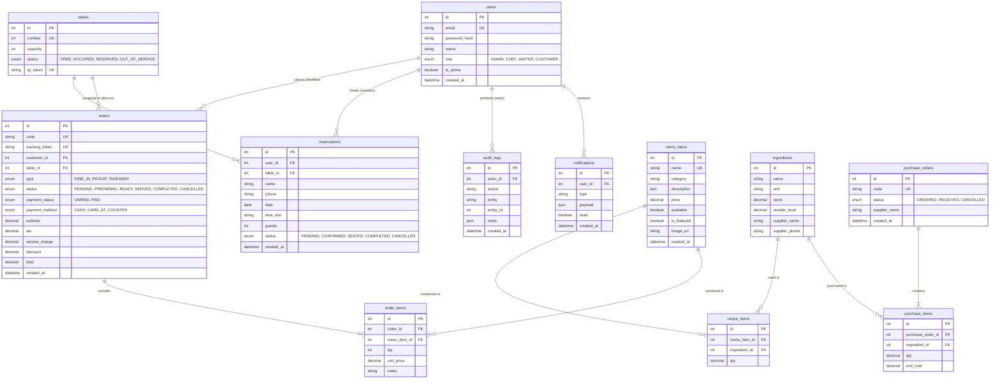

# Palatia — Database ERD & Schema Specification

## 🗄️ Entity-Relationship Diagram (ERD)

The database is built on **MySQL 8** (character set `utf8mb4`) and managed via **Prisma ORM**. It enforces relational integrity, monetary precision using `DECIMAL`, and strict unique constraints at the database level.

---

## 📋 Table Definitions & Constraints

### 1. `users`
Stores user accounts for both staff and customers.
- `id`: `INT AUTO_INCREMENT` (PK)
- `email`: `VARCHAR(191)` (UNIQUE) — Used for authentication.
- `password_hash`: `VARCHAR(191)` — Bcrypt hash (10 rounds).
- `role`: `ENUM('ADMIN', 'CHEF', 'WAITER', 'CUSTOMER')` (DEFAULT: `'CUSTOMER'`).
- `is_active`: `BOOLEAN` (DEFAULT: `true`) — Allows deactivation of staff accounts.

### 2. `tables`
Physical restaurant dining tables.
- `id`: `INT AUTO_INCREMENT` (PK)
- `number`: `INT` (UNIQUE) — Table number (e.g., Table 1, Table 2).
- `capacity`: `INT` — Max seats.
- `status`: `ENUM('FREE', 'OCCUPIED', 'RESERVED', 'OUT_OF_SERVICE')`.
- `qr_token`: `VARCHAR(191)` (UNIQUE, Nullable) — Cryptographic random token encoded in table QR code. Rotating this token revokes printed QR sheets instantly.

### 3. `reservations`
Table reservations for customers (guests & members).
- `id`: `INT AUTO_INCREMENT` (PK)
- `user_id`: `INT` (FK $\rightarrow$ `users.id`, Nullable) — Populated if booked by logged-in member.
- `table_id`: `INT` (FK $\rightarrow$ `tables.id`).
- `name`: `VARCHAR(191)` (Nullable) — Inline guest name if anonymous.
- `phone`: `VARCHAR(191)` (Nullable) — Inline guest phone if anonymous.
- `date`: `DATE` — Reservation date (`YYYY-MM-DD`).
- `time_slot`: `VARCHAR(191)` — Slot time (e.g. `"11:00"`, `"12:00"` ... `"21:00"`).
- `status`: `ENUM('PENDING', 'CONFIRMED', 'SEATED', 'COMPLETED', 'CANCELLED')`.
- 🔑 **CRITICAL DB CONSTRAINT**: `UNIQUE INDEX (table_id, date, time_slot)`
  - *Guarantees zero double-booking at the database layer.*

### 4. `menu_items`
Catalog of food & beverage dishes.
- `id`: `INT AUTO_INCREMENT` (PK)
- `name`: `VARCHAR(191)` (UNIQUE) — Dish name.
- `category`: `VARCHAR(191)` — Category string (`Main Course`, `Beverage`, `Snack`, `Side Dish`).
- `description`: `TEXT` (Nullable) — Kitchen notes / dish description.
- `price`: `DECIMAL(10, 2)` — Selling price.
- `available`: `BOOLEAN` (DEFAULT: `true`).
- `is_featured`: `BOOLEAN` (DEFAULT: `false`).
- `image_url`: `VARCHAR(500)` (Nullable) — Storage path (e.g., `/uploads/menu/ayam-geprek.jpg`).

### 5. `recipe_items`
Maps ingredients to menu items for stock deduction and chef composition viewing.
- `id`: `INT AUTO_INCREMENT` (PK)
- `menu_item_id`: `INT` (FK $\rightarrow$ `menu_items.id`, ON DELETE CASCADE).
- `ingredient_id`: `INT` (FK $\rightarrow$ `ingredients.id`).
- `qty`: `DECIMAL(10, 4)` — Ingredient quantity required for 1 portion.

### 6. `ingredients`
Inventory stock tracking.
- `id`: `INT AUTO_INCREMENT` (PK)
- `name`: `VARCHAR(191)` — Ingredient name (e.g. "Sayap Ayam", "Minyak Goreng").
- `unit`: `VARCHAR(191)` — Storage unit (e.g. "kg", "L", "pcs").
- `stock`: `DECIMAL(10, 4)` — Current stock level.
- `reorder_level`: `DECIMAL(10, 4)` — Minimum stock threshold before triggering low-stock alert.

### 7. `orders` & `order_items`
Customer order transactions.
- `orders.code`: `VARCHAR(191)` (UNIQUE) — Human-readable order code (e.g., `ORD-8F2A`).
- `orders.tracking_token`: `VARCHAR(191)` (UNIQUE, Nullable) — Unguessable token used for public guest order status tracking and Pay Now checkout.
- `orders.status`: `ENUM('PENDING', 'PREPARING', 'READY', 'SERVED', 'COMPLETED', 'CANCELLED')`.
- `orders.payment_status`: `ENUM('UNPAID', 'PAID')`.
- `order_items.notes`: `VARCHAR(150)` (Nullable) — Kitchen customization notes per item (max 150 chars).

---

## ⚡ Data Integrity & Monetary Rules

1. **No Floating Point Money / Stock**: All currency values (`price`, `subtotal`, `tax`, `discount`, `total`) and inventory metrics (`stock`, `qty`) use `DECIMAL(10,2)` or `DECIMAL(10,4)` to prevent IEEE 754 precision loss.
2. **Transaction Isolation**: Order completion and inventory stock auto-deduction run inside `prisma.$transaction()` blocks.
3. **Cascading Deletes**: `recipe_items` cascade on `menu_items` deletion; orders with past items block deletion to preserve sales history.
