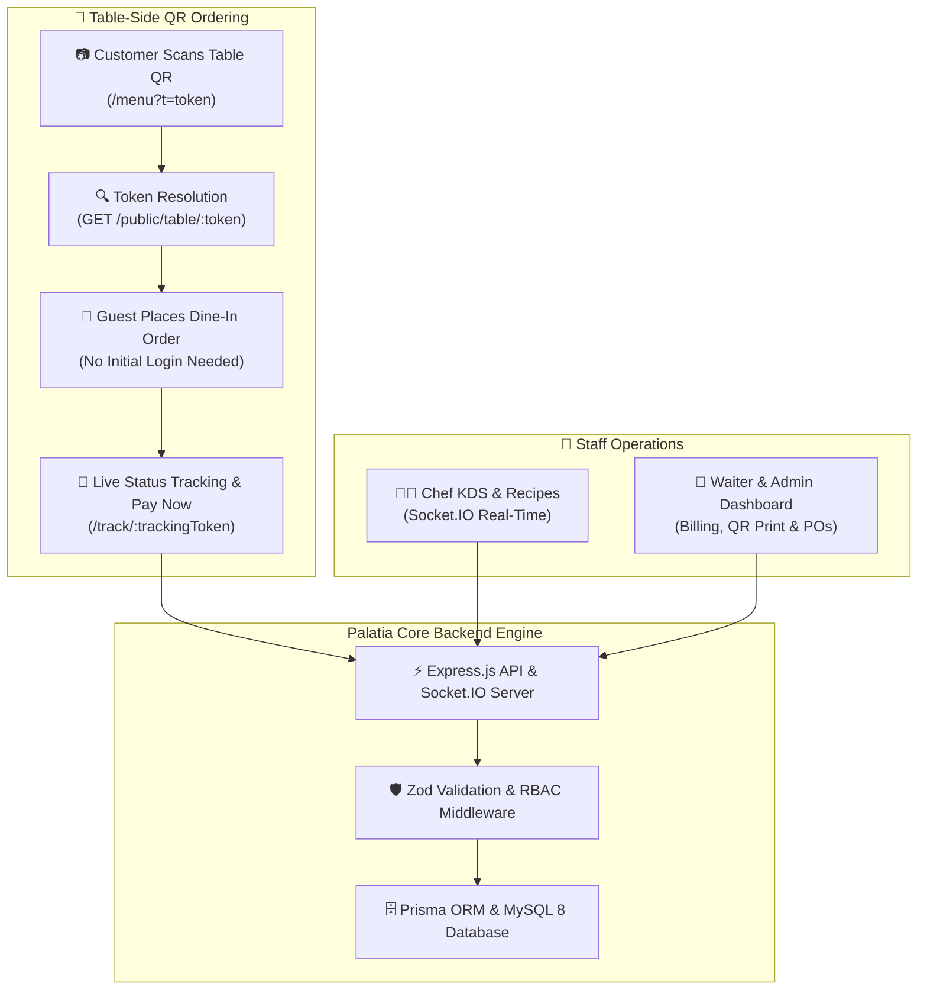

# Palatia — Product Vision & Executive Summary

## 📌 Product Overview

**Palatia** is a modern, full-stack enterprise-grade **Restaurant Management & Dining Platform** designed to seamlessly bridge front-of-house customer experiences, kitchen operations, floor service, and back-office management into a unified real-time ecosystem.

Driven by a single, high-performance Node.js / Express REST API and Socket.IO engine, Palatia supports multi-platform interactions via an installable Progressive Web App (PWA) and responsive staff dashboards:
1. **Web Public Surface & Installable PWA (`(public)`)**: Customer landing page, interactive public menu, **table-side QR code guest ordering**, live order tracking, table reservations, and PWA capabilities (`manifest.ts` + Service Worker `sw.js` for offline caching and home-screen installation).
2. **Web Backoffice Surface (`(backoffice)`)**: Role-governed operational dashboards for **Admin**, **Chef**, and **Waiter**.

---

## 🚀 Problem Statement

Traditional small-to-medium restaurants often struggle with fragmented operations:
- **Friction in Table Ordering**: Guests wait for waiters to bring physical menus and take orders manually, leading to order delays and higher staffing costs.
- **Operational Silos**: Reservations recorded manually on paper led to double-booking conflicts and customer friction.
- **Communication Lag**: Kitchen staff rely on physical paper tickets or manual callouts, creating order fulfillment bottlenecks.
- **Inventory Leakage**: Ingredients are consumed without automated tracking, resulting in stockouts of high-demand dishes or unexpected ingredient waste.
- **Disconnected Data**: Managers lack real-time visibility into daily sales performance, popular menu items, and operational audit trails.

---

## 💡 The Palatia Solution

Palatia unifies restaurant operations into a **single, event-driven digital platform**:

---

## ⭐ Key Platform Differentiators

### 1. 📲 Table QR Code Dining & Guest Ordering Engine
- **Frictionless QR Table Scanning**: Customers scan a table-side QR code (`/menu?t=<token>`) with their smartphone camera. The system instantly resolves the cryptographic token (`GET /api/public/table/:token`) and pre-binds the order to that specific table without forcing the customer to register or log in.
- **Anonymous Guest Ordering & Secure Tracking**: Guests place orders seamlessly. The server generates an unguessable `trackingToken` (preventing order enumeration attacks), allowing guests to track live preparation status (`/track/:token`) and execute online checkout via `Pay Now`.
- **Printable Table QR Sheets & Security Token Rotation**: Admin can generate & print QR PNG sheets per table (`/print/qr-sheet` & `GET /api/bo/tables/:id/qr.png`). Admin can also **rotate (revoke)** table tokens with one click (`POST /api/bo/tables/:id/qr`) to instantly invalidate old physical prints for maximum security.

### 2. Progressive Web App (PWA) Experience
- Native Web App Manifest (`manifest.ts`) enables one-tap installation on mobile and desktop devices without app store friction.
- Custom Service Worker (`sw.js`) provides offline asset caching and resilient fallback handling.

### 3. Real-Time Kitchen Display System (KDS)
- Orders transition instantly to the Kitchen Queue upon payment placement via Socket.IO events within `< 1 second`.
- Gates unpaid orders from reaching the kitchen, ensuring zero unpaid preparation waste.

### 4. DB-Enforced Anti Double-Booking Engine
- Enforces reservation integrity at the database schema level via a unique compound index `(table_id, date, time_slot)`.
- Eliminates application-level race conditions—two customers booking the exact same table slot concurrently cannot both succeed.

### 5. Chef Recipe Catalog & Smart Unit Conversion
- Chef-exclusive catalog (`/kitchen/recipe`) displaying ingredient compositions per dish.
- Intelligent **cooking unit formatting** automatically converts fractional storage units into chef-friendly culinary units (`0.2 kg` $\rightarrow$ `200 gram`, `0.05 L` $\rightarrow$ `50 ml`).
- Numbered ingredient step badges (`1, 2, 3`) for fast, clean prep visual cues.

### 6. Automated Inventory Auto-Deduction & Reorder Alerts
- Completing an order automatically deducts individual recipe ingredient stock from inventory via database transactions.
- Automated low-stock alerts trigger real-time notifications to Admin accounts when stock falls below reorder thresholds.

---

## 👥 Role & User Persona Matrix

| Role | Primary Goal | Key Features & Access |
|---|---|---|
| **Customer** | Effortless dining, QR ordering, tracking & booking | Table-side QR scanning, guest order placement, live tracking, PWA install, cart, table reservations |
| **Chef** | Rapid order preparation & recipe accuracy | Real-time KDS queue (PENDING $\rightarrow$ PREPARING $\rightarrow$ READY), Chef Recipe catalog |
| **Waiter** | Smooth table service, floor management & billing | Order status update (READY $\rightarrow$ SERVED $\rightarrow$ COMPLETED), table picker, billing & receipt print |
| **Admin** | Total operational oversight & business growth | Menu CRUD, staff management, table QR generation/rotation, printable QR sheets, inventory POs, reports, audit logs |

---

## 📈 Success Metrics & Business Impact

- **Table Turnaround & Order Speed**: Instant QR ordering cuts customer wait times and reduces waiter order-taking overhead.
- **Order Processing Speed**: Cut ticket-to-kitchen latency from ~3 minutes to under 1 second.
- **Reservation Accuracy**: 100% elimination of double-booked table slots.
- **Inventory Variance**: Reduced stock leakage through automated post-completion ingredient deduction.
- **App Availability**: Instant PWA installation across Android, iOS, and Desktop devices with 0% app store deployment friction.
